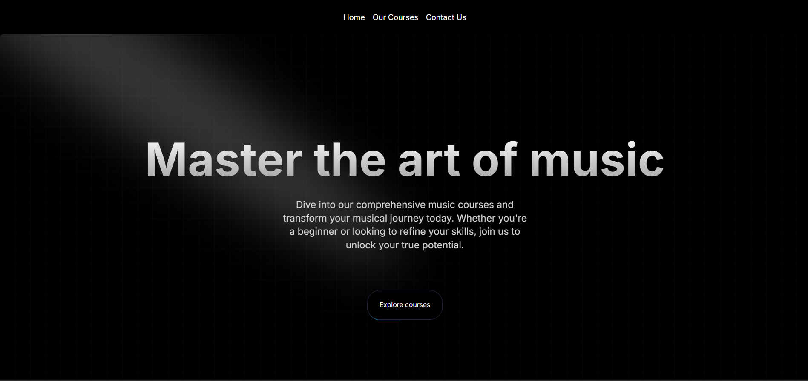
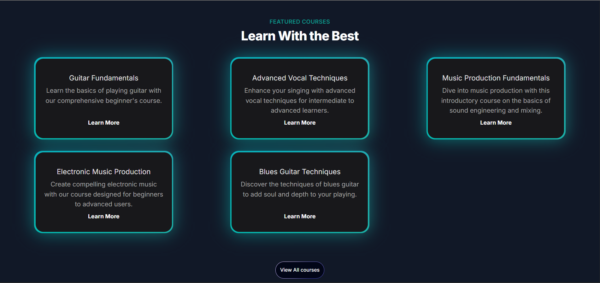
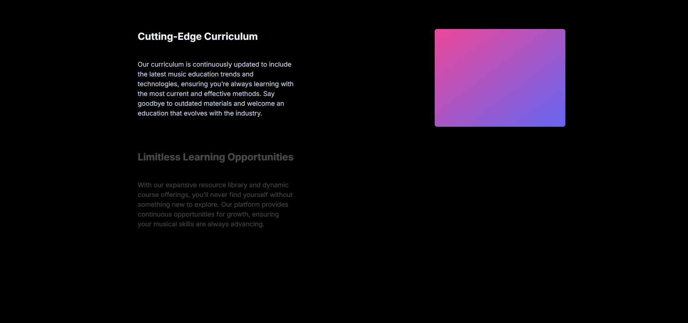
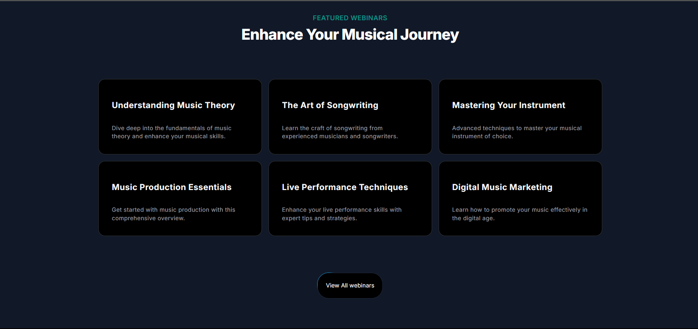
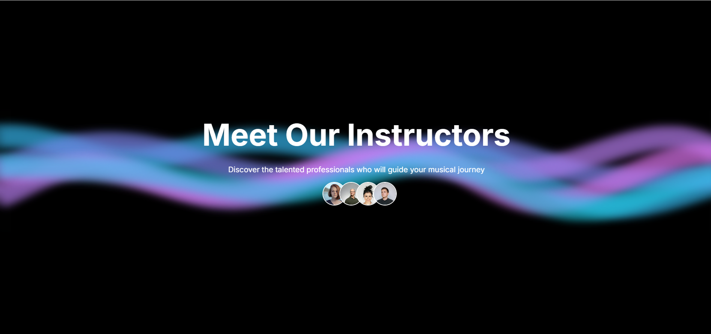
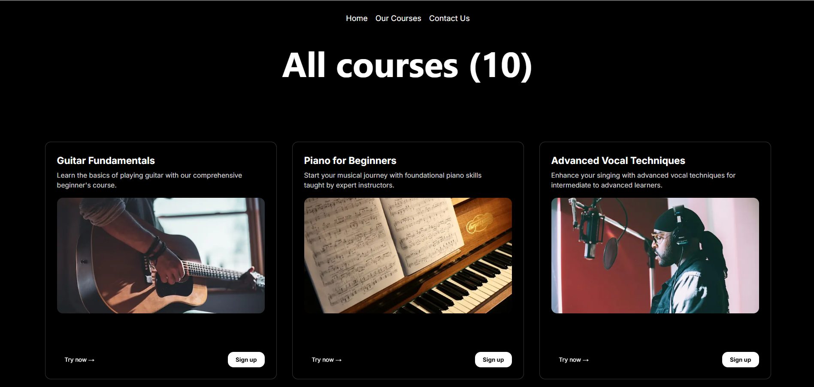
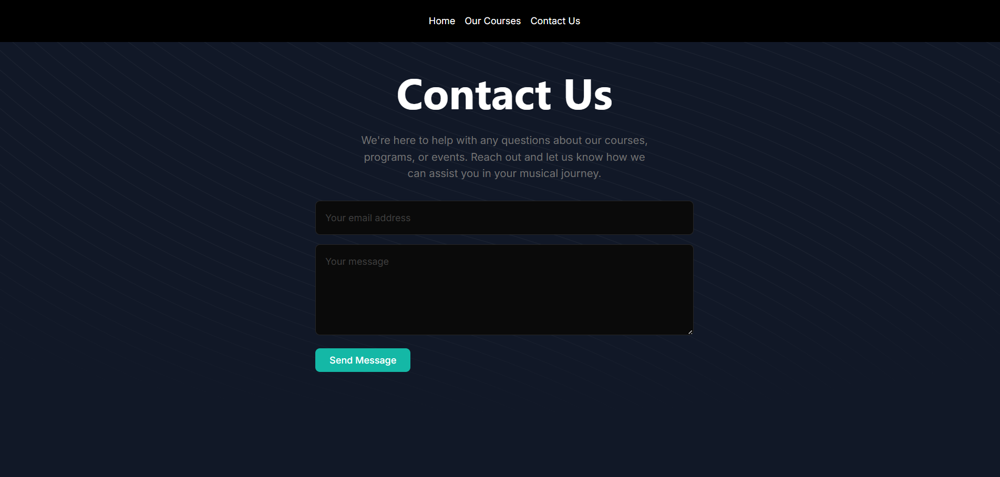
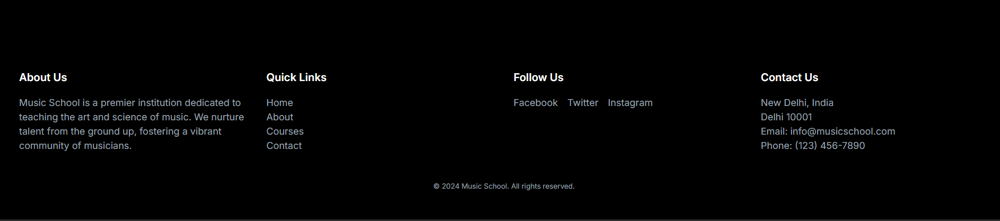

# 🎵 Music Learning Platform

A modern, responsive web application built with **Next.js** to showcase featured music courses, webinars, instructors, testimonials, and more for a music school.

---

## 🚀 Features

- 🎹 **Hero Section** – Welcoming and engaging landing banner
- 📚 **Featured Courses** – Highlights top music courses offered
- 🌟 **Why Choose Us** – Showcases the platform's unique strengths
- 🗣️ **Testimonials** – Real student feedback for social proof
- 🎤 **Upcoming Webinars** – Stay updated with live learning sessions
- 🧑‍🏫 **Instructors** – Display skilled instructors from the music school
- 🦶 **Footer** – Clean, minimal footer with essential links

---

## 📁 Project Structure
music-learning-platform/
│
├── .next/                  # Next.js build output (auto-generated)
├── node_modules/           # Installed npm packages
├── public/                 # Public assets (images, fonts, etc.)
│
├── src/                    # Main source code folder
│   ├── app/                # App Router directory (Next.js 13+)
│   │   ├── contact/        # Contact page route
│   │   │   └── page.tsx
│   │   ├── courses/        # Courses page route
│   │   │   └── page.tsx
│   │   ├── favicon.ico     # Site icon
│   │   ├── globals.css     # Global styles
│   │   ├── layout.tsx      # Root layout component
│   │   └── page.tsx        # Home page route
│   │
│   ├── components/         # Reusable components
│   │   ├── ui/             # (Currently empty or UI-specific base components)
│   │   ├── FeaturedCourses.tsx
│   │   ├── Footer.tsx
│   │   ├── HeroSection.tsx
│   │   ├── Instructors.tsx
│   │   ├── Navbar.tsx
│   │   ├── TestimonialCards.tsx
│   │   ├── UpcomingWebinars.tsx
│   │   └── WhyChooseUs.tsx
│   │
│   ├── data/               # Static/mock data
│   │   └── music_courses.json
│   │
│   └── utils/              # Utility functions
│       └── cn.ts           # Classname helper (likely tailwind-merge or clsx)
│
├── .eslintrc.json          # Linting configuration
├── .gitignore              # Git ignore rules
├── bun.lock                

---

## 🧪 Tech Stack

- **Framework**: Next.js 13+
- **Language**: TypeScript
- **Styling**: Tailwind CSS
- **Icons**: @tabler/icons-react
- **Animation**: Framer Motion

---

## 📦 Installation

```bash
# Clone the repository
git clone https://github.com/your-username/music-learning-platform.git
cd music-learning-platform

# Install dependencies
npm install
# or
bun install

npm run dev
# or
bun dev
```
---

## 📸 Screenshots

| Page | Screenshot |
|------|-----------|
| *Home Page* |  |
| *Courses Page* |  |
| *Why Choose Us* |  |
| *Webinar Page* |  |
| *Instructors Page* |  |
| *All Courses* |  |
| *Contact Us* |  |
| *Footer* |  |
